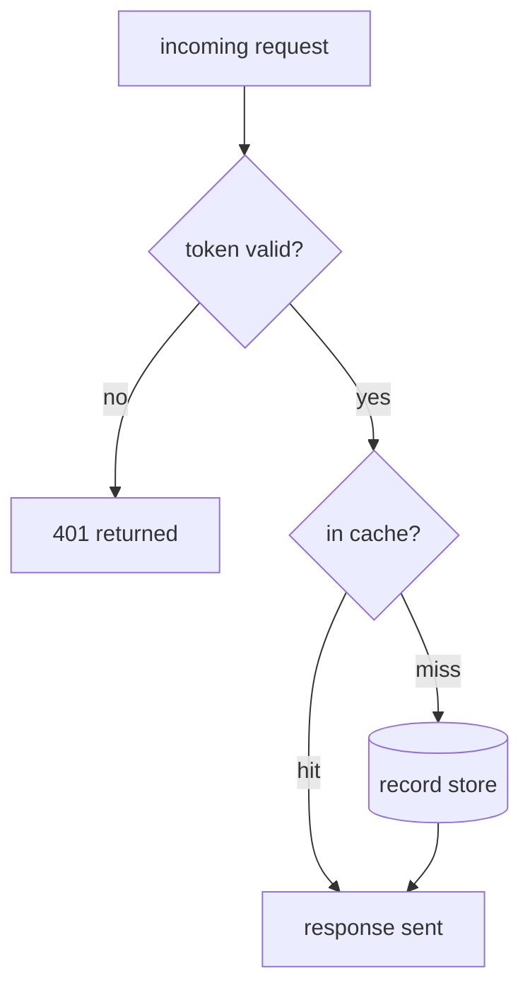
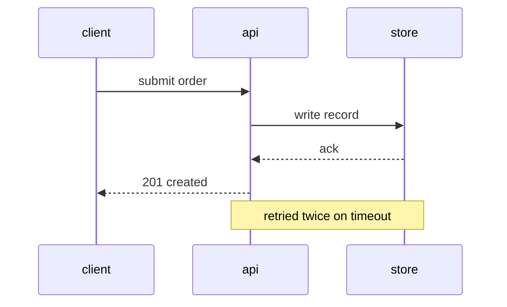
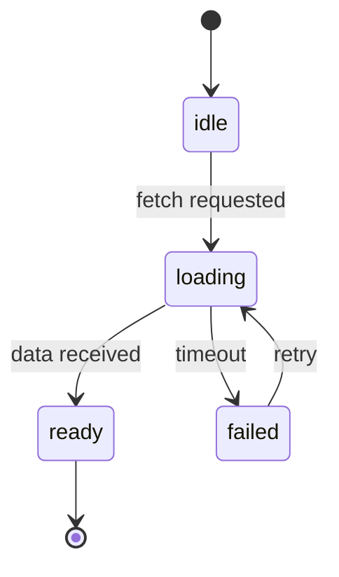
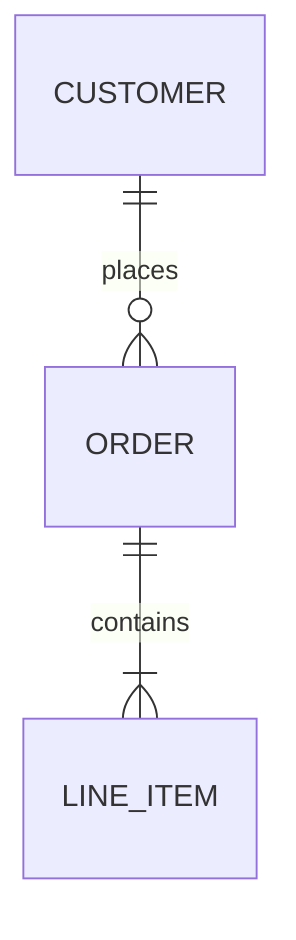
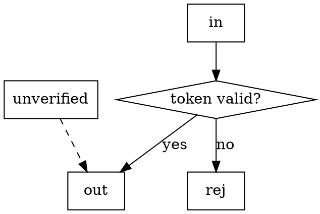
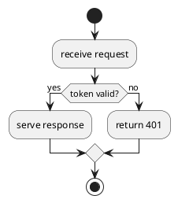
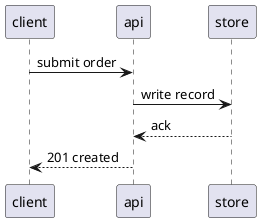

# Syntax minimums

The smallest correct form per library and type. Copy the shape, replace the labels, add nothing —
themes, classes and styling stay out unless a shape carries meaning.

## Mermaid (default)

Flowchart — `TD` top-down for processes, `LR` for pipelines:



Shapes: `[box]` step · `{diamond}` decision · `([stadium])` start/end · `[(cylinder)]` store ·
`[[subroutine]]` a step drawn in detail elsewhere. Dashed edge for unverified: `a -.-> b`.

Sequence — `participant` order is the column order, so put the initiator first:



`->>` call · `-->>` reply · `alt`/`else`/`end` for branches · `loop … end` for repetition.

State — the label on the arrow is the event, not the state:



ER:



Gotchas: quote any label holding `()`, `,` or `:` — `a["step (fast path)"]`; `end` is reserved, write
`End` or `done`; a subgraph is a container, not a node — edges attach to what is inside it.

## Graphviz



`rankdir=LR` for pipelines · `shape=cylinder` for a store · `subgraph cluster_x { label="…" }` for a
boxed group. Ids with spaces or punctuation must be quoted.

## D2

```d2
direction: down
in: incoming request
auth: token valid?  { shape: diamond }
store: record store { shape: cylinder }

in -> auth
auth -> rej: no
auth -> store: yes
store -> out
```

Nesting is containment — `api.handler -> api.store` draws both inside `api`. Dashed edge:
`a -> b { style.stroke-dash: 4 }`.

## PlantUML

Activity:



Sequence:



Keep `skinparam` out; the default rendering is fine and the diagram is the point.
